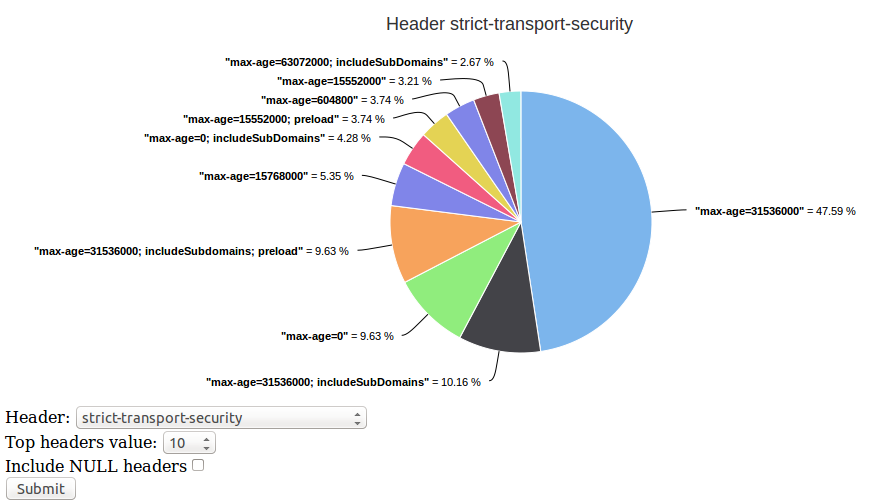

<h1>HTTP response headers</h1>
HTTP headers are well known and also despised. Seeking the balance between usability and security developers implement functionality through the headers that can make your more versatile or secure application. 
But in practice how the headers are being implemented? What sites follow the best implementation practices? Big companies, small, all or none? 

<h3>headers.py</h3>
Python script to get all response headers from Alexa top sites file and store in a MySQL database. 
Syntax: $ python headers.py (Alexa csv top sites file) (Number of concurrent threads) 
Eg.: 
<pre>$ python headers.py top-1k.csv 200
Thread pool 1 ( 0 - 200 )
Thread pool 2 ( 200 - 400 )
Thread pool 3 ( 400 - 600 )
Thread pool 4 ( 600 - 800 )
Thread pool 5 ( 800 - 1000 )

Connections summary 
https: 366 
http: 579 
error: 55

Populating MySQL tables
Table: site
Table: header_value
Table: header_name
Table: header</pre>

<h3>headers.sql</h3>
MySQL database scheme exported with the command below: 
<pre>$ mysqldump -u root -p --no-data headers header header_name header_value site > headers.sql</pre>
To import you can use this command: 
<pre>$ mysql -u username -p headers < headers.sql</pre>

<h3>headers-top-1k.sql</h3>
MySQL database with 1000 sites exported with the command below: 
<pre>$ mysqldump -u root -p headers header header_name header_value site > headers-top-1k.sql</pre>
To import you can use this command: 
<pre>$ mysql -u username -p headers < headers-top-1k.sql</pre>

<h3>top-1k.csv</h3>
Just an Alexa top sites file example with 1000 records. 

<h3>www/</h3>
PHP pages with Highcharts graphics. 
Eg.: 
 

